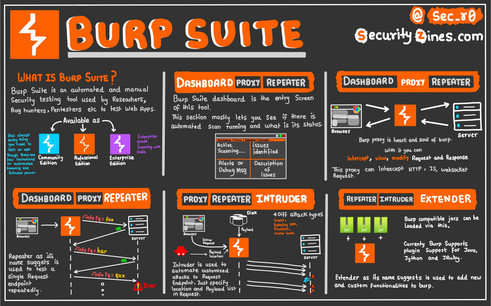

:last-update-label!:

= TP B3 - Problématiques liées à l'identification et à l'authentification

== Introduction

Ce TP vise à examiner quelques vulnérabilités liées à l'identification et à l'authentification sur une application web.

Dans un premier temps, vous devrez comprendre le mécanisme des attaques. Dans un second temps, l'objectif est de réaliser des preuves de concept d'attaques sur une application web vulnérable.

== Présentation de la vulnérabilité

L'*identification* et l'*authentification* sont des étapes clés de la sécurité dans une application web, qui font partie du *contrôle d'accès* (identification + authentification + *autorisations*).

L'identification consiste à déclarer qui l'on est (souvent avec un identifiant ou une adresse mail), tandis que l'authentification permet de prouver cette identité (par exemple en donnant un mot de passe).

Dans une application bien conçue, seules les personnes autorisées doivent accéder à certaines
fonctionnalités ou données. Si l'identification ou l'authentification est mal gérée, des utilisateurs
malveillants peuvent se faire passer pour d'autres. C'est pourquoi il est essentiel, lors du développement, d'appliquer les bonnes pratiques de sécurité
pour ces mécanismes.

Dans le classement _OWASP Top 10:2025_, la vulnérabilité « _Authentication Failures_ » se classe en 7ème position. Elle regroupe les failles qui permettent à un attaquant d'outrepasser l'authentification, de forcer des mots de passe ou encore d'accéder à des comptes sans autorisation.

Quelques exemples fréquents :

* CWE-287[https://cwe.mitre.org/data/definitions/287.html] : Authentification manquante ou incorrecte.
* CWE-798[https://cwe.mitre.org/data/definitions/798.html] : Utilisation de mots de passe codés en dur dans le code.
* CVE-2020-14750[https://nvd.nist.gov/vuln/detail/cve-2020-14750] : Faille dans Oracle WebLogic permettant une connexion sans authentification.

== Exemple de code

Voici quelques exemples de codes vulnérables :

=== PHP - Authentification simple et vulnérable

[source,php]
----
if ($_POST['password'] == "admin123") {
  echo "Accès autorisé";
}
----

Mauvaise pratique : mot de passe en clair dans le code, sans gestion d'utilisateurs ni vérification
sécurisée.

=== JavaScript (côté client) - Authentification côté client

[source,js]
----
if (user === "admin" && password === "1234") {
  window.location = "admin.html";
}
----

L'authentification est visible et modifiable depuis le navigateur. Aucune sécurité côté serveur.

=== Python (Flask) - Session non protégée

[source,python]
----
@app.route('/admin')
def admin():
  if session.get('logged_in'):
    return "Bienvenue admin"
----

Risque : si un utilisateur modifie la session sans vérification du rôle ou identifiant, il peut accéder à
une page réservée.

== Les différentes formes d'authentification

On rappelle qu'il existe plusieurs formes d'authentification selon le facteur utilisé :

1. *Connaissance* : mot de passe, code PIN
2. *Possession* : téléphone, carte à puce, clé USB sécurisée
3. *Inhérence* : empreinte digitale, reconnaissance faciale, reconnaissance comportementale

On peut y ajouter d'autres facteurs non primaires, comme le *contexte de connexion* (géolocalisation, horaires, adresse IP) ou des facteurs liés au type d'appareil utilisé (type d'OS, navigateur, etc.).

*La MFA (Multi-Factor Authentication) combine au moins deux types différents de facteurs* pour renforcer la sécurité. Par exemple, un mot de passe (connaissance) associé à une confirmation via app mobile (possession).

== Contre-mesures de limitation et d'évitement

Pour éviter les failles d'authentification, plusieurs bonnes pratiques sont recommandées :

* Ne jamais stocker de mots de passe en clair : ils doivent être hachés en utilisant des algorithmes spécialisés pour les mots de passe (bcrypt, Argon2...)
* Appliquer une politique de mots de passe forts
* Protéger les pages critiques avec une authentification serveur, et gérer correctement les
sessions
* Implémenter une limite de tentatives (protection contre la force brute pure ou attques par dictionnaire)
* Éviter les messages d'erreur trop explicites (« _Mot de passe incorrect_ » ou « _Utilisateur
inexistant_ » donnent des informations aux attaquants)
* Utiliser des bibliothèques de sécurité reconnues pour gérer l'authentification

== Authentification et réglementation

La CNIL et le RGPD imposent de sécuriser l'accès aux données à caractère personnel. Cela concerne
directement l'identification et l'authentification.

Selon la CNIL, l'accès à des données sensibles doit être protégé par une *authentification forte*. On rappelle que l'authentification forte repose sur un *mécanisme cryptographique* dont les paramètres et la sécurité sont jugés robustes (l'élément secret est alors généralement une clé cryptographique).

Les développeurs doivent aussi :

* Prévoir un système de *journalisation des accès* (RGPD : droit à la sécurité)
* *Informer les utilisateurs des traitements de leurs données* (RGPD : droit à l'information)
* Permettre la *modification et suppression* des comptes (RGPD : droit à l'effacement)

Les entreprises doivent pouvoir démontrer leur conformité (ex : preuve de l'implémentation de mesures de sécurité adéquates).

Ne pas respecter ces règles peut entraîner des sanctions importantes, en particulier :

* En cas de violation de données, l'entreprise doit *notifier la CNIL* dans les 72 heures, sous peine d'amende
* Les amendes pour non-conformité peuvent atteindre *20 millions d'euros ou 4% du chiffre d'affaires annuel mondial*, selon le montant le plus élevé

== Labos en ligne

Les preuves de concept permettant d'illustrer la problématique de l'authentification que nous allons ici utiliser sont mises à disposition sur le site https://portswigger.net. PortSwigger est un leader mondial dans la création d'outils logiciels pour les tests de sécurité des applications Web (ex : _Burp Suite_).

Avant de commencer ces labos, il est nécessaire de :

* créer un compte sur le site de portswigger
* installer Burp Suite

== Mise en place de Burp Suite

BurpSuite est une plateforme qui permet d'effectuer des tests de sécurité sur les applications web. Elle joue le rôle d'un proxy qui se positionne entre le navigateur de l'attaquant et le serveur contenant l'application web à tester.

image::assets/burp_proxy.svg[Burp Suite Proxy, align="center"]

Il capture les requêtes effectuées afin de pouvoir les analyser, les modifier et les rejouer en modifiant les paramètres.

BurpSuite incorpore notamment les outils suivants :

* *Proxy* : intercepte et modifie les requêtes HTTP/S entre navigateur et serveur
* *Intruder* : permet de réaliser des attaques automatisées en injectant des _payloads_ dans les requêtes
* *Repeater* : permet de rejouer manuellement des requêtes HTTP/S modifiées pour tester les réponses du serveur
* *Scanner* : analyse automatiquement les applications web à la recherche de vulnérabilités

Burp Suite est un outil commercial, mais une version gratuite est disponible : https://portswigger.net/burp/communitydownload[Burp Suite Community Edition]. C'est la version que nous allons utiliser pour ce TP.

Ensuite, il faut configurer Burp en tant que proxy. Il y a deux possibilité :

* Configurer un navigateur externe pour utiliser Burp comme proxy
* Utiliser le navigateur intégré de Burp (Burp Browser), qui est préconfiguré pour fonctionner avec le proxy de Burp

=== Configuration d'un navigateur externe

Pour configurer un navigateur externe pour utiliser Burp comme proxy, il faut modifier ses paramètres de proxy pour rediriger le trafic HTTP/S vers l'adresse `127.0.0.1:8080`. Voici les étapes générales pour Firefox (facilement adaptable à d'autres navigateurs) :

* Ouvrir les paramètres du navigateur
* Aller dans la section « Réseau » et configurer les paramètres de connexion
* Choisir « Configuration manuelle du proxy »
* Saisir `127.0.0.1` comme adresse du proxy et `8080` comme port
* Cocher la case « Utiliser ce proxy pour HTTPS »

Il est conseillé d'utiliser un navigateur dédié pour Burp ayant cette configuration, ou bien d'utiliser les profils de navigateur pour éviter d'affecter la navigation normale (profil spécifique nommé « Burp » par exemple ayant cette configuration proxy).

=== Utilisation de Burp Suite

Pour utiliser Burp Suite, il suffit de lancer l'application et d'utiliser le navigateur configuré pour accéder à l'application web vulnérable. Burp interceptera les requêtes HTTP/S et vous permettra de les analyser, les modifier et les « rejouer » (_replay_).

Lancer Burp Suite en confirmant les options laissées par défaut. Vous pouvez alors tester l'application.

==== HTTP History : visualisation de requêtes

Il faut sélectionner l'onglet `Proxy`, puis sur le sous-onglet `HTTP History`. Vous pouvez ensuite accéder à n'importe quel site web depuis le navigateur configuré, et vous verrez les requêtes capturées dans le sous-onglet `HTTP History` de Burp. Sélectionnez alors une requête pour voir les détails de la requête HTTP et de la réponse HTTP.

==== Intercept : interception de requêtes

 En cliquant alors sur le bouton `Intercept off` dans le sous-onglet `Intercept`, Burp va automatiquement se mettre à intercepter les requêtes HTTP/S, c'est-à-dire qu'il va bloquer les requêtes avant qu'elles ne soient envoyées au serveur, et vous pourrez les analyser et les modifier avant de les envoyer. L'interception bloque les réponses de serveur tant que vous n'avez pas validé la requête dans Burp (bouton `Forward`).*

Attention, cela a pour conséquence que le client reste bloqué en attente de la réponse du serveur tant que vous n'avez pas validé la requête dans Burp. Donc n'oubliez pas de cliquer sur `Forward` pour débloquer le client et de désactiver l'interception (bouton `Intercept on`) une fois que vous avez terminé d'analyser/modifier les requêtes.

==== Repeater : rejouer une requête

Le sous-onglet `Repeater` permet de rejouer manuellement des requêtes HTTP/S modifiées pour tester les réponses du serveur. Pour envoyer une requête dans Repeater, il suffit de sélectionner une requête dans `HTTP History`, puis de cliquer sur le bouton `Send to Repeater`. Vous pouvez ensuite modifier la requête dans l'onglet `Repeater` et cliquer sur le bouton `Send` pour envoyer la requête modifiée au serveur et voir la réponse.

Vous pouvez ainsi tester manuellement différentes approches ou _payloads_ pour voir comment le serveur réagit.

==== Intruder : attaques automatisées

Le sous-onglet `Intruder` permet de réaliser des attaques automatisées en injectant des _payloads_ automatiquement dans les requêtes. Pour envoyer une requête dans _Intruder_, il suffit de sélectionner une requête dans `HTTP History`, puis de cliquer sur le bouton `Send to Intruder`. Vous pouvez ensuite :

* configurer les positions d'injection (les parties de la requête où vous souhaitez injecter des _payloads_) en sélectionnant le texte et en cliquant sur `Add`
* choisir les listes de _payloads_ à utiliser (panneau de droite)
* lancer l'attaque pour voir les réponses du serveur.

 Notez que, en version gratuite, _Intruder_ est bridé au niveau de la vitesse d'attaque, mais ce ne sera pas très gênant pour les labos de ce TP.

== Méthodologie de rendu

Vous rédigerez vos réponses sur ce fichier README, en gardant la même structure et les questions. Les réponses seront simplement ajoutées à la suite de chaque question, en utilisant le formatage Asciidoc si nécessaire. Vous inclurez des _screenshots_ pour illustrer vos réponses.

Pour inclure une image, vous pouvez utiliser la syntaxe suivante : `image::screenshot13.png[screenshot 1.3, align="center"]`

Pour écrire au format « code » en asciidoc (commandes, code source, requêtes HTTP brutes...) , il suffit d'encadrer le texte avec des balises de code (les tripe-backticks arkdown sont aussi acceptées en Asciidoc) :

[source]
----
 [source]
 ----
 GET /success.txt?ipv4 HTTP/1.1
 Host: detectportal.firefox.com
 User-Agent: Mozilla/5.0 (X11; Linux x86_64; rv:148.0) Gecko/20100101
 ----
----

Vous ferez des _commits/push_ réguliers avec l'avancement des questions/réponses. Vous vérifierez sur le dépôt GitHub que vos réponses sont bien visibles, lisibles, complètes et correctement formatées, et que les captures d'écran sont claires et bien affichées.

== Les labos d'attaque

=== Labo 1 : Énumération de logins et attaque par force brute

L'objectif est d'identifier un identifiant valide, puis de deviner son mot de passe en testant de nombreuses combinaisons.

- https://portswigger.net/web-security/authentication/password-based/lab-username-enumeration-via-different-responses[lien du labo]

Ce laboratoire présente des vulnérabilités liées à l'énumération des noms d'utilisateurs et à la force brute des mots de passe. Un compte y est accessible à partir d'un identifiant facile à deviner et d'un mot de passe faible, tous deux présents dans des dictionnaires dédiés.

*1.1* Identifier (au niveau HTTP, en utilisant Burp et en examinant les requêtes/réponses) comment le client envoie les données d'identification et comment le serveur répond à différentes tentatives de connexion

*1.2* Utiliser _Burp Intruder_ pour automatiser les tentatives de connexion en utilisant la liste de logins fournie comme _payload_.

  - Analyser les réponses du serveur pour identifier un login valide
  - La taille des réponses est souvent un indicateur intéressant pour identifier les réponses particulières, on peut ensuite examiner plus en détail en quoi elles diffèrent exactement

*1.3* Casser maintenant le mot de passe de l'utilisateur identifié en utilisant la liste de mots de passe fournie (procéder de manière similaire avec _Intruder_).

*1.4* Accéder au compte en utilisant les identifiants de connexion découverts pour valider le succès du labo.

=== Labo 2 : Contournement d'une authentification à double facteur

Ce labo consiste à contourner une authentification renforcée reposant sur l'envoi d'un code de vérification par e-mail.

- https://portswigger.net/web-security/authentication/multi-factor/lab-2fa-simple-bypass[lien du labo]

L'authentification à deux facteurs de ce labo peut être contournée. Dans ce labo, Vous disposez déjà d'un nom d'utilisateur et d'un mot de passe valides (compte de `carlos``), mais ce compte est protégé par une vérification 2FA, ce qui empêche l'accès au compte. La vérification consiste en l'envoi d'un code de validation par email.

Pour résoudre le problème, vous allez utiliser un compte auquel vous avez accès (compte de `wiener`).

*2.1* Analyser le processus d'authentification à deux facteurs lors de la connexion au compte `wiener` (utilisez le bouton `Email client` pour accéder à vos emails), en utilisant Burp Suite et en examinant les requêtes/réponses.

*2.2* Utiliser les informations obtenues pour contourner la vérification 2FA du compte `carlos` et accéder à ce compte pour valider le labo.

*2.3* Analyser ce qui rend cette vulnérabilité possible et indiquer les contre-mesures à adopter.

=== Labo 3 : Réinitialisation malveillante d'un mot de passe

Le but est d'exploiter une vulnérabilité dans le mécanisme de réinitialisation du mot de passe pour accéder frauduleusement à un compte utilisateur.

- https://portswigger.net/web-security/authentication/other-mechanisms/lab-password-reset-broken-logic[lien du labo]

La fonctionnalité de réinitialisation du mot de passe de ce laboratoire est vulnérable. Pour résoudre le labo, réinitialiser le mot de passe de l'utilisateur Carlos, puis se connecter et accéder à sa page « mon compte ».

*3.1* Analyser le processus de réinitialisation de mot de passe à partir du compte contrôlé `wiener`, en utilisant Burp Suite et en examinant les requêtes/réponses.

*3.2* Utiliser les inforamtions obtenues pour réinitialiser le mot de passe du compte `carlos` et accéder à ce compte pour valider le labo.

*3.3* Examiner les facteurs qui rendent cette vulnérabilité possible et proposer des contre-mesures appropriées.
